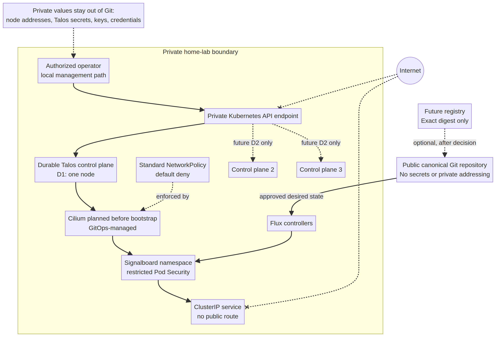

# Phase 3 Durable Platform Design

**Status:** Approved design foundation; no durable hardware or private credentials created
**Scope:** Week 2 / Phase 3
**Owner:** Repository maintainer
**Last reviewed:** 2026-08-28

## Purpose

Phase 2 proved one original application can travel from public Git source to a disposable Kind cluster through Flux and return by Git rollback. Phase 3 must turn that workflow into a **production-shaped learning environment** without pretending that a large pile of tools is automatically valuable. This document selects the smallest credible durable design and identifies the decisions that cannot be made safely without the actual network and hardware context.

The recommended durable node operating system remains Talos Linux. Talos provides an API-managed Kubernetes-focused platform; its production guidance treats control-plane availability, secure configuration, reliability, and authenticated access as core concerns. [1] The initial durable design deliberately separates the **single-control-plane learning profile** from a later **high-availability profile**. Three control-plane members are the smallest topology that can tolerate a single etcd member failure; two control-plane members do not provide that property. [2]

## Target private topology

*Figure 1. A sanitized private-by-default topology. The diagram deliberately contains no address, hostname, credential, or physical-site information.*

## Chosen Phase 3 design

| Design area | Decision | Why this adds value now | Explicit limit |
|---|---|---|---|
| Durable platform | Prepare Talos Linux templates and a bootstrap runbook, but do not generate machine credentials or apply configuration until the actual hardware inventory is complete. | Teaches immutable, API-driven node configuration and makes hardware assumptions visible. | No node is provisioned by this repository yet. |
| Availability claim | Start with a **single-control-plane durable learning environment** unless the operator deliberately supplies three suitable control-plane nodes and a resilient API endpoint. | It is honestly operable by one person and avoids spending on high availability before the core workflow is valuable. | It is not high availability; loss of the control-plane node causes control-plane outage. |
| HA expansion | Define a future profile of three control-plane nodes and one or more workers. | It becomes worthwhile only when control-plane quorum, endpoint redundancy, and node replacement are real teaching objectives. | Never claim HA until all three nodes and the API endpoint have passed failure tests. |
| CNI and policy enforcement | Select Cilium through a GitOps-managed Helm release for the durable cluster; use standard Kubernetes `NetworkPolicy` resources first. | It supplies a clear enforcement mechanism for the existing default-deny policy while preserving portable policy syntax. [3] [4] | Cilium is not installed in the Phase 2 Kind cluster, so the Phase 2 policy declaration is not presented as an enforcement test. |
| Pod Security | Enforce the Kubernetes `restricted` Pod Security Standard in the Signalboard namespace and audit/warn at the same level. | The existing workload already meets the intended non-root, seccomp, capability, and filesystem posture; namespace policy turns those conventions into an admission boundary. [5] | Platform namespaces may require explicitly documented exceptions; do not label all namespaces blindly. |
| Application traffic | Keep Signalboard private. Use a ClusterIP Service and local port-forward until a specific private-access use case exists. | This preserves the existing safe and demonstrable access path. | No public DNS, public ingress, tunnel, public load balancer, or router port-forward is part of this phase. |
| Remote access | Do not install an overlay network, identity provider, or VPN yet. Evaluate private overlay access only after the local control-plane path, revocation procedure, and named operator identity are defined. | Prevents a new identity and networking stack from obscuring the core lab. | Remote access is intentionally not a current project capability. |
| Image identity | Keep manual local image loading for disposable Kind. For durable deployment, use GitHub Container Registry or an equivalent registry and pin the exact image digest in the environment overlay through a pull request. | A digest in Git binds the declared deployment to an immutable artifact and retains human-readable review. | No registry publication, signing key, or automatic image mutation is enabled yet. |
| Secrets | Keep the public repository free of secret material. Decide SOPS with Age or cloud KMS only when the first genuine secret is required. | Avoids inventing key custody and encryption workflow without a real secret and owner. | No `.sops.yaml`, Age private key, or encrypted placeholder is created in this phase. |

## Hardware capability profiles

The project does not select products or ask for a purchase in this design. The inventory must record the equipment actually available before a profile is selected.

| Profile | Minimum capability target | Appropriate use | Claim that may be made | Claim that must not be made |
|---|---|---|---|---|
| D1: durable learning node | One reimageable x86_64 or ARM64 host, 4 CPU cores, 16 GB memory, 256 GB NVMe or SSD, wired network, and stable power. | First Talos control-plane and workload node; repeatable node lifecycle; Cilium and policy exercises. | Single-control-plane durable learning environment. | High availability, quorum tolerance, replicated storage resilience, or zero downtime. |
| D2: resilient lab | Three equivalent control-plane-capable hosts, each with independent system disk and wired network; one or more dedicated worker-capable hosts are optional. | etcd quorum and control-plane replacement exercise. | Three-member HA control plane only after endpoint and failure evidence exists. | Disaster recovery or workload HA without separate storage and workload evidence. |
| D3: storage expansion | D2 plus separately evaluated storage capacity and failure domain design. | Stateful applications in Phase 4. | Storage design under evaluation. | Durable application data or restore capability before a restore drill. |

A hardware inventory is a gate, not a formality. Record model, CPU architecture, memory, system disk, additional disks, NIC link speed, firmware state, power protection, current role, reimage permission, physical location at a high level, and recovery access. Do **not** commit serial numbers, public addresses, Wi-Fi credentials, router screenshots, or exact private addresses to this public repository.

## Network and access boundary

The durable design uses a private-by-default boundary. Talos management, Kubernetes API access, and application traffic remain on the local network. Stable addressing may use DHCP reservations or static addressing, but the real ranges and interface names are private operator input and must remain outside the public repository.

| Surface | Phase 3 position | Evidence required before it changes |
|---|---|---|
| Talos API | Private management access only. | Named operator, management path, node recovery procedure, and no public port forwarding. |
| Kubernetes API | Private control-plane endpoint only. | Endpoint design, access matrix, revocation procedure, and failure test. |
| Signalboard | ClusterIP and local port-forward only. | A documented private-access user journey plus authentication and route tests. |
| DNS and TLS | Deferred. | A real application route that justifies certificates and a named internal DNS authority. |
| Gateway API or Ingress | Deferred. | A real routing requirement that cannot be met with the current internal path. |
| Internet exposure | Prohibited by default. | Explicit owner approval, threat model update, authentication, TLS, rate-control decision, and a test plan. |

## Policy foundation

Two safe policy controls are introduced now. They make the desired posture concrete without assuming a CNI capability that has not been installed in development.

| Control | Repository artifact | Current behavior | Durable-cluster acceptance test |
|---|---|---|---|
| Pod Security Admission | `apps/base/signalboard/namespace.yaml` | Signalboard is labeled `enforce=restricted`, `audit=restricted`, and `warn=restricted`, pinned to Kubernetes v1.37. | A deliberately non-compliant Pod is rejected in the Signalboard namespace; the current Signalboard rollout remains healthy. |
| Default-deny network policy | `apps/base/signalboard/network-policy.yaml` | The policy is declared in Git; enforcement depends on the selected CNI. | A Cilium-enabled cluster proves an unauthorized client cannot reach Signalboard and proves the intentionally allowed path works after a specific allow rule is added. |

Cilium supports standard Kubernetes NetworkPolicy as well as Cilium-specific policies. The project starts with standard resources to keep the intent portable, then uses Cilium-specific rules only when a concrete Layer 7 or policy-observability requirement justifies them. [4] Talos documents a GitOps-friendly Cilium deployment path and requires CNI lifecycle choices to be made before bootstrap. [3]

## Durable-image and promotion boundary

The current development path intentionally uses local image loading because Kind is disposable. That is not sufficient for a durable deployment. The next approved image-delivery path is review-first and digest-pinned:

1. A pull request runs existing application, repository, and manifest checks.
2. CI builds a Signalboard image and publishes it only after a dedicated registry decision has been recorded.
3. CI records the immutable digest as build evidence.
4. A separate pull request changes only the durable environment’s image digest and release note.
5. Flux reconciles the reviewed digest; verification captures Git revision, image digest, application version, and rollout status.
6. Rollback changes the environment overlay back to the prior digest through Git.

Image automation, Cosign signing, provenance attestations, and automatic production updates are deferred. They are useful only after the registry path exists and a corresponding verification exercise can prove their value.

## Ordered implementation sequence

| Order | Action | Owner decision required? | Completion evidence |
|---|---|---|---|
| 1 | Complete the sanitized hardware inventory from actual equipment. | Yes | Inventory reviewed against D1, D2, and D3 profiles. |
| 2 | Select D1 or D2 and create an availability ADR with explicit claims and non-claims. | Yes | ADR accepted through protected pull request. |
| 3 | Record the private network design with placeholders only; store actual values outside public Git. | Yes | Sanitized topology and private operator worksheet. |
| 4 | Build Talos configuration templates with variable placeholders and explicit secret-file exclusions. | Yes, before generating credentials | Template render review; no sensitive values in Git scan. |
| 5 | Select Cilium version and installation method for Talos before first durable bootstrap. | Yes | Helm release values, bootstrap dependency record, and version-pinned manifest review. |
| 6 | Add a narrow Signalboard allow rule only after the first legitimate caller and traffic path exist. | Yes | Passing allowed/denied connectivity test pair. |
| 7 | Choose a registry and manually promote a digest through a protected pull request. | Yes | CI result, digest evidence, Flux revision, and rollback test. |
| 8 | Choose secret custody only when a real secret is introduced. | Yes | Secret-management ADR, ownership record, and authorized bootstrap test. |

## Stop conditions

Stop and ask for a user decision rather than continuing automatically if any of the following occurs: a hardware purchase or reimage is required; actual private addresses, router settings, or Wi-Fi credentials are needed; a Talos secrets bundle or client configuration would be generated; a registry credential, Age private key, cloud key, or identity provider account would be created; a public endpoint, DNS record, tunnel, or port forward would be opened; or an application requires persistent data.

## References

[1]: https://docs.siderolabs.com/talos/v1.13/getting-started/prodnotes "Talos Linux — Production Clusters"
[2]: https://docs.siderolabs.com/talos/v1.13/learn-more/control-plane "Talos Linux — Control Plane"
[3]: https://docs.siderolabs.com/kubernetes-guides/cni/deploying-cilium "Talos Linux — Deploy Cilium CNI"
[4]: https://docs.cilium.io/en/stable/network/kubernetes/policy/ "Cilium — Network Policy"
[5]: https://kubernetes.io/docs/concepts/security/pod-security-admission/ "Kubernetes — Pod Security Admission"
